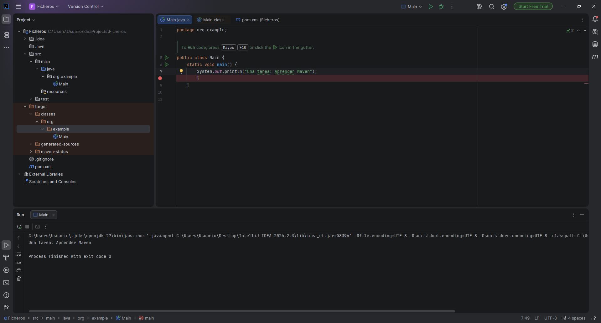
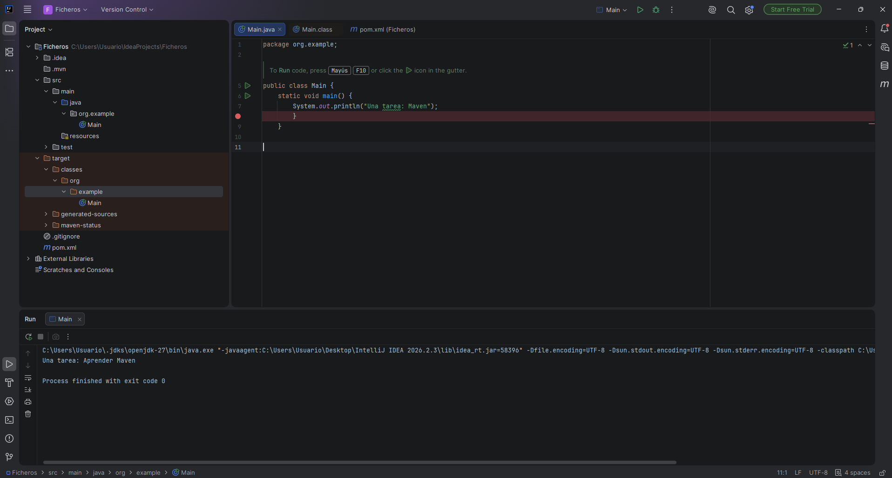
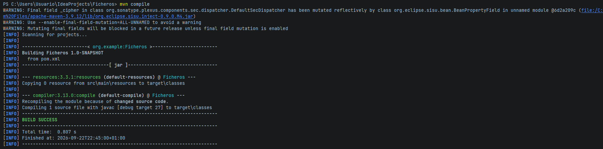
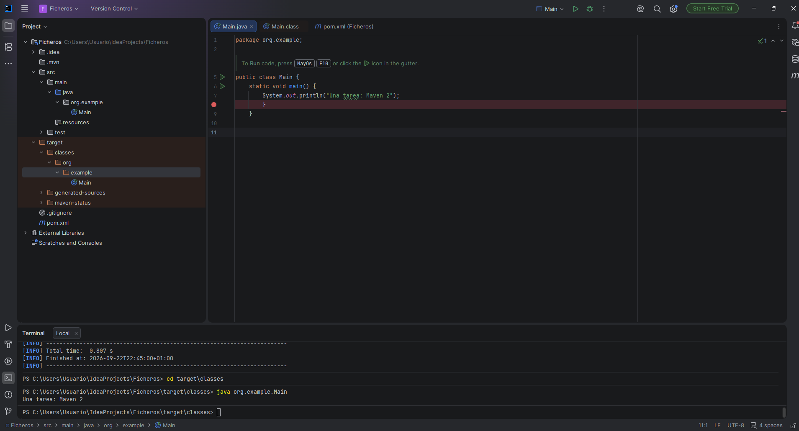

# Práctica Maven.

## Qué problema resuelve Maven

### 1.Aplicación Java Inicial

Se creó una clase main con un método que muestra un mensaje por consola.

### 2.Modificación del código

Modificamos el mensaje del System.out.println() en el Main.java, para ejecutar el programa sim volverlo a compilar. El resultado siguió siendo el mensaje anterior. Esto ocurre porque al moidificar el Main.java no modifica el archivo Main.class. El programa sigue ejecutando la versiuón compilada anteiormente.

### 3.Compilación con Maven

Ejecutamos el comando "mvn compile", haciendo que maven compile de nuevo el proyecto y actualizando los archivos del .class.

### 4.Ejecución después de recompilar

Finalmente, se volvió a ejecutar el programa "java org.example.Main". En esta vez el podemos apreciar el - nuevo mensaje que pusimos.

### Conclusión

Esta práctica permite comprobar la diferencia entre el código fuente y el código compilado.

El JDK proporciona las herramientas necesarias para compilar y ejecutar Java, y Maven se encarga de coordinar el proceso de construcción del proyecto.

En este caso, mvn compile permite recompilar el código fuente y actualizar los archivos .class cuando se realizan cambios en el programa.
